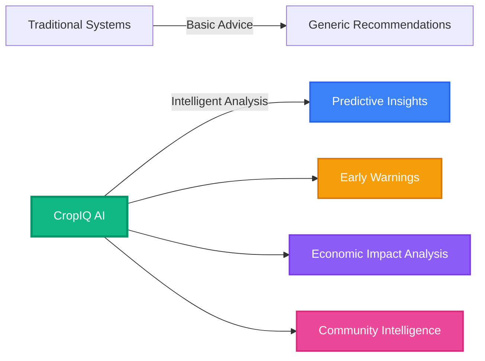
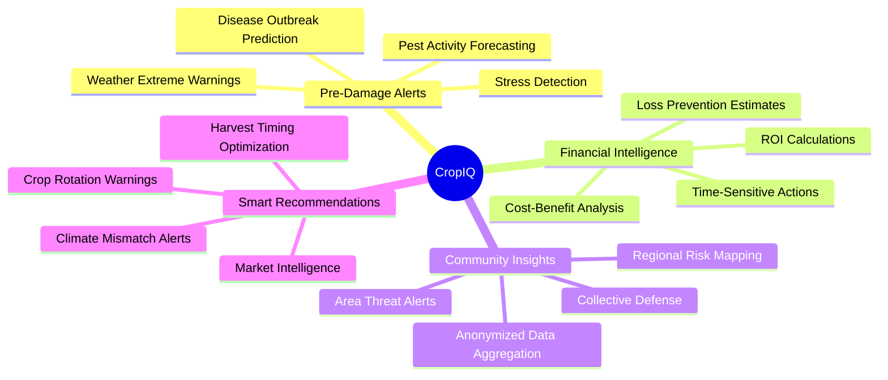
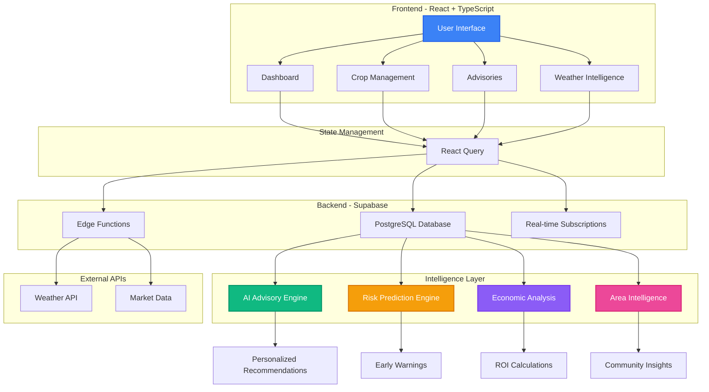
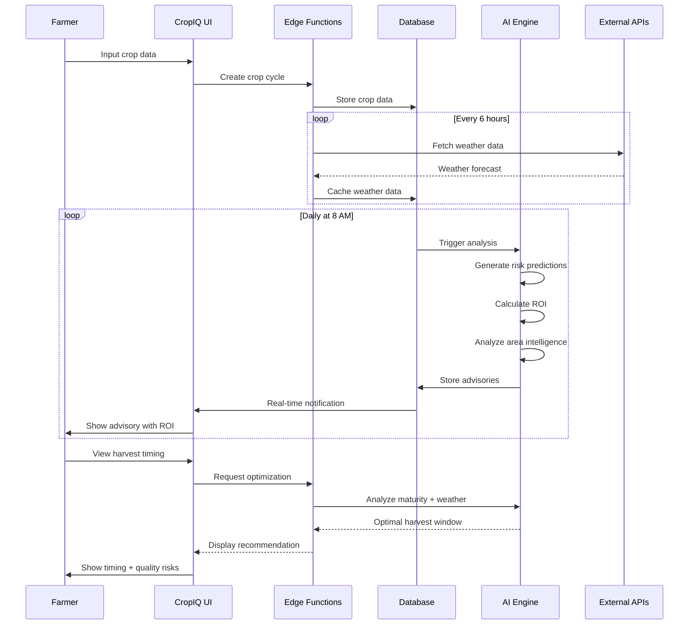
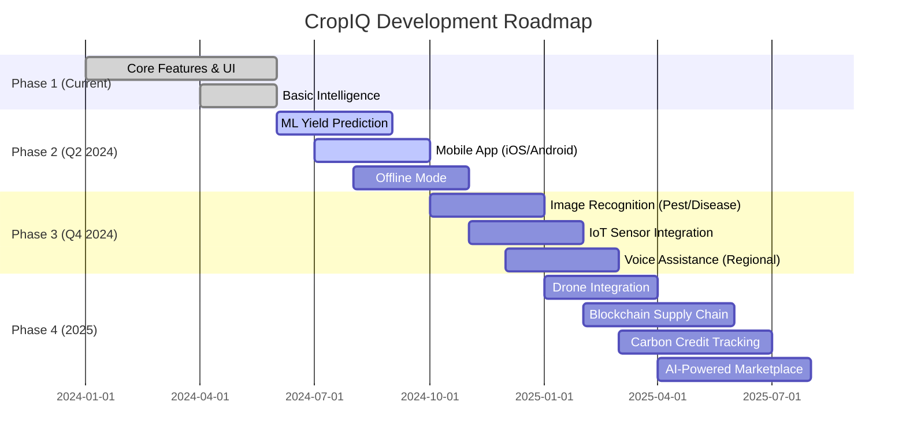

#  CropIQ - AI-Powered Smart Farming Assistant

<div align="center">


[](https://reactjs.org/)
[](https://www.typescriptlang.org/)
[](https://tailwindcss.com/)
[](LICENSE)

**Transforming Agriculture with AI-Driven Intelligence**

[Features](#-key-features) • [Architecture](#-system-architecture) • [Getting Started](#-quick-start) • [Roadmap](#-future-scope)

</div>

---

## 🎯 What Makes CropIQ Unique?

CropIQ goes **beyond traditional farm advisory systems** by providing:



### 🔥 Unique Value Propositions

| Feature | Traditional Systems | CropIQ |
|---------|-------------------|---------|
| **Prediction Window** | Reactive (post-damage) | 3-7 days advance warning ⚡ |
| **Financial Clarity** | Generic advice | Exact ROI & loss prevention 💰 |
| **Community Data** | Individual only | Area-wide intelligence 🌍 |
| **Decision Support** | Basic tips | Wrong-decision warnings ⚠️ |
| **Seasonal Intelligence** | Static advice | Dynamic deviation analysis 📊 |

---

## ✨ Key Features



### 🚨 **1. Pre-Damage Alert System**
- **Disease Outbreak Prediction**: 3-7 days before visible symptoms
- **Pest Breeding Forecasts**: Based on temperature trends
- **Water/Heat Stress Detection**: Before crop damage occurs
- **Example**: *"High disease risk detected. Acting now saves ₹8,000 vs ₹1,500 prevention cost (433% ROI)"*

### 💰 **2. Financial Impact Analysis**
Every recommendation includes:
- Immediate action cost
- Loss prevention amount
- ROI calculation
- Cost of inaction timeline

### 🌍 **3. Area-Level Community Intelligence**
- Anonymized data from nearby farms (10km radius)
- Regional pest/disease pressure mapping
- Community early warning system
- Collective defense coordination

### ⚠️ **4. Wrong Decision Warnings**
- Crop rotation risk detection
- Climate-practice mismatch alerts
- Poor market timing warnings
- Suboptimal harvest timing

### 📊 **5. Seasonal Deviation Analysis**
- Rainfall deviation from historical averages
- Temperature pattern changes
- Timing shift detection
- Yield impact assessment

---

## 🏗️ System Architecture



### Technology Stack

**Frontend**
- ⚛️ React 18.3 + TypeScript 5.8
- 🎨 Tailwind CSS + shadcn/ui
- 📊 Recharts for data visualization
- 🌐 i18next for multi-language support
- 🔄 React Query for state management

**Backend**
- 🗄️ Supabase (PostgreSQL)
- ⚡ Edge Functions (TypeScript)
- 🔐 Row Level Security (RLS)
- 📡 Real-time subscriptions

**Intelligence**
- 🤖 AI-driven advisory engine
- 📈 ML-ready yield prediction
- 🌦️ Weather data caching & forecasting
- 💹 Market intelligence analysis

---

## 🚀 Quick Start

### Prerequisites
- Node.js 18+ and npm
- Git

### Installation

```bash
# Clone the repository
git clone <your-repository-url>
cd crop-iq-smart-farming-assistant-main

# Install dependencies
npm install

# Start development server
npm run dev
```

The application will open at `http://localhost:8080`

### Available Scripts

```bash
npm run dev          # Start development server
npm run build        # Production build
npm run preview      # Preview production build
npm run lint         # Run ESLint
npm run test         # Run tests
```

---

## 📊 Data Flow Diagram



---

## 🗺️ Future Scope



### 🎯 Planned Features

#### **Q2 2024**
- 📱 Native mobile apps (iOS & Android)
- 🤖 Advanced ML yield prediction models
- 📡 Offline-first architecture with sync

#### **Q4 2024**
- 📸 Image recognition for pest/disease identification
- 🌡️ IoT sensor integration (soil moisture, pH, NPK)
- 🎙️ Voice assistance in 10+ regional languages

#### **2025**
- 🚁 Drone integration for field mapping
- ⛓️ Blockchain-based supply chain tracking
- 🌱 Carbon credit calculation & marketplace
- 🛒 AI-powered direct-to-consumer marketplace
- 🔬 Soil health scoring with recommendations
- 💧 Automated irrigation control

---

## 📄 License

This project is licensed under the MIT License - see the [LICENSE](LICENSE) file for details.

---

## 🤝 Contributing

Contributions are welcome! Please feel free to submit a Pull Request.

---

## 📧 Contact & Support

- **GitHub Issues**: [Report bugs or request features](../../issues)
- **Documentation**: Check the `/docs` folder for detailed guides
- **Backend Setup**: See [README_BACKEND.md](README_BACKEND.md)
- **Intelligence Features**: See [README_INTELLIGENCE_FEATURES.md](README_INTELLIGENCE_FEATURES.md)

---

<div align="center">

**Made with ❤️ for farmers worldwide**

*Empowering agriculture through AI-driven intelligence*

</div>
