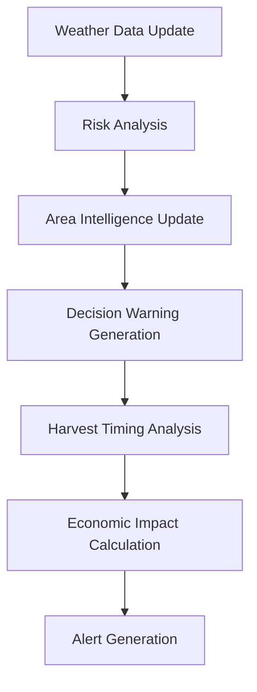

# CropIQ Advanced Intelligence Layer

## 🧠 Enhanced Intelligence Features

CropIQ's advanced intelligence layer transforms the platform from a basic advisory system into a sophisticated early-warning and decision-support system that provides insights even experienced farmers cannot easily infer from day-to-day observations.

## 🚨 Pre-Damage Alert System

### Early Warning Capabilities
- **Disease Outbreak Prediction**: Analyzes humidity, temperature, and rainfall patterns to predict disease outbreaks 3-7 days before visible symptoms
- **Pest Activity Forecasting**: Monitors temperature trends to forecast pest breeding cycles and migration patterns
- **Stress Condition Detection**: Identifies water stress, heat stress, and nutrient deficiencies before crop damage becomes visible
- **Weather Extremes Alert**: Warns about impending weather conditions that could cause crop damage

### Risk Prediction Engine
```sql
-- Example risk prediction for disease outbreak
{
  "risk_type": "disease",
  "risk_level": "critical",
  "probability": 0.9,
  "time_to_impact_days": 3,
  "confidence_score": 0.85,
  "economic_impact_estimate": 8000,
  "prevention_cost_estimate": 1500,
  "predicted_loss_if_ignored": 8000,
  "mitigation_strategies": [
    "Apply preventive fungicide immediately",
    "Improve field drainage",
    "Reduce irrigation frequency"
  ]
}
```

## 💰 Loss Prevention Intelligence

### Financial Impact Analysis
Every recommendation includes detailed economic analysis:

- **Immediate Cost**: What action will cost right now
- **Loss Prevention**: How much loss will be avoided
- **ROI Calculation**: Return on investment for taking action
- **Cost of Inaction**: Financial impact of delaying or ignoring advice
- **Time Sensitivity**: How costs increase with delayed action

### Example Economic Insight
```
"Act now to prevent ₹8,000 loss. Investing ₹1,500 in prevention gives you 433% return on investment by avoiding damage. Delaying action by 3 days could increase loss to ₹12,000."
```

## 🌍 Area-Level Community Intelligence

### Regional Risk Mapping
- **Anonymized Data Aggregation**: Combines data from nearby farms while protecting privacy
- **Regional Risk Patterns**: Identifies emerging threats in the surrounding area
- **Community Early Warnings**: Alerts farmers when nearby areas experience pest outbreaks or disease
- **Collective Defense**: Enables coordinated response to regional threats

### Area Intelligence Features
```json
{
  "area_intelligence": {
    "disease_pressure": 0.85,
    "pest_activity": 0.72,
    "weather_stress": 0.45,
    "dominant_concerns": [
      "High disease pressure in the area",
      "Increased pest activity detected"
    ],
    "preventive_recommendations": [
      "Consider preventive fungicide application",
      "Monitor for pest infestations"
    ]
  }
}
```

## ⚠️ Wrong Decision Warnings

### Habitual Pattern Detection
The system identifies and warns against potentially risky decisions based on data:

- **Crop Rotation Risks**: Flags consecutive planting of same crop
- **Climate Mismatch**: Warns when practices don't match changing climate patterns
- **Input Timing Errors**: Identifies suboptimal application timing
- **Market Timing Risks**: Alerts about poor harvest or selling timing

### Decision Warning Example
```json
{
  "warning_type": "crop_rotation_risk",
  "risk_level": "medium",
  "current_decision": {
    "crop": "rice",
    "consecutive_seasons": 3
  },
  "recommended_alternative": {
    "recommended_crops": ["legumes", "oilseeds"],
    "rotation_benefits": "soil_health_improvement"
  },
  "economic_consequences": {
    "short_term_loss": 900,
    "long_term_loss": 2100,
    "cumulative_impact": 2520
  },
  "potential_loss_estimate": 3000
}
```

## 📊 Seasonal Difference Analysis

### Comparative Intelligence
Instead of generic advice, the system highlights what's different this season:

- **Rainfall Deviation Analysis**: Compares current rainfall patterns to historical averages
- **Temperature Pattern Changes**: Identifies unusual temperature trends
- **Timing Shifts**: Detects changes in planting, growth, and harvest timing
- **Yield Impact Assessment**: Shows how seasonal differences affect expected yields

### Seasonal Comparison Example
```json
{
  "seasonal_comparisons": [
    {
      "comparison_season": "current",
      "rainfall_deviation_percent": -25,
      "temperature_deviation_percent": 8,
      "planting_date_deviation_days": -5,
      "key_differences": [
        "Rainfall is 25% lower than average",
        "Temperature is 8% higher than average",
        "Planted 5 days earlier than usual"
      ]
    }
  ],
  "key_insights": [
    "Significant rainfall variation detected: deficit conditions",
    "Temperature patterns changed significantly: warmer season"
  ]
}
```

## 🌾 Harvest Timing Risk Detection

### Optimal Harvest Window Analysis
Advanced algorithms determine the perfect harvest timing:

- **Maturity Assessment**: Calculates exact crop maturity percentage
- **Weather Window Analysis**: Identifies optimal weather conditions for harvesting
- **Quality Risk Assessment**: Evaluates risks of early vs. late harvesting
- **Market Price Impact**: Analyzes how harvest timing affects market value

### Harvest Optimization Example
```json
{
  "optimization": {
    "current_maturity_percentage": 92,
    "optimal_harvest_date": "2024-03-15",
    "days_to_optimal": 3,
    "maturity_stage": "mature",
    "harvest_window": {
      "start_days": 0,
      "end_days": 7,
      "risk_factors": ["High heat may affect crop quality"]
    },
    "quality_risks": {
      "early_harvest": {
        "risk_level": "low",
        "yield_loss_percent": 5,
        "quality_impact": "Reduced grain size and market value"
      },
      "late_harvest": {
        "risk_level": "medium",
        "yield_loss_percent": 8,
        "quality_impact": "Lodging risk, grain shattering"
      }
    }
  }
}
```

## 🔧 Technical Implementation

### Database Schema Enhancements
```sql
-- Risk predictions with economic analysis
CREATE TABLE risk_predictions (
    id UUID PRIMARY KEY,
    crop_cycle_id UUID REFERENCES crop_cycles(id),
    risk_type VARCHAR(50) NOT NULL,
    risk_level VARCHAR(20) NOT NULL,
    probability DECIMAL(3,2),
    time_to_impact_days INTEGER,
    confidence_score DECIMAL(3,2),
    economic_impact_estimate DECIMAL(10,2),
    prevention_cost_estimate DECIMAL(10,2),
    predicted_loss_if_ignored DECIMAL(10,2),
    mitigation_strategies JSONB,
    contributing_factors JSONB
);

-- Area-level intelligence
CREATE TABLE area_intelligence (
    id UUID PRIMARY KEY,
    center_lat DECIMAL(10,8),
    center_lng DECIMAL(11,8),
    radius_km DECIMAL(6,2),
    total_farms INTEGER,
    dominant_crop_type crop_type,
    regional_risks JSONB,
    weather_anomalies JSONB,
    pest_disease_alerts JSONB
);

-- Decision warnings
CREATE TABLE decision_warnings (
    id UUID PRIMARY KEY,
    farmer_id UUID REFERENCES profiles(id),
    warning_type VARCHAR(50),
    risk_level VARCHAR(20),
    current_decision JSONB,
    recommended_alternative JSONB,
    reasoning JSONB,
    potential_loss_estimate DECIMAL(10,2),
    confidence_score DECIMAL(3,2)
);

-- Harvest timing analysis
CREATE TABLE harvest_timing_analysis (
    id UUID PRIMARY KEY,
    crop_cycle_id UUID REFERENCES crop_cycles(id),
    optimal_harvest_date DATE,
    maturity_percentage DECIMAL(5,2),
    weather_window_analysis JSONB,
    quality_risk_if_early JSONB,
    quality_risk_if_late JSONB,
    price_impact_analysis JSONB
);
```

### API Endpoints

#### Intelligence Layer
```http
GET /functions/v1/intelligence?type=risk_predictions&crop_cycle_id=uuid
GET /functions/v1/intelligence?type=area_intelligence
GET /functions/v1/intelligence?type=decision_warnings
GET /functions/v1/intelligence?type=harvest_timing&crop_cycle_id=uuid
GET /functions/v1/intelligence?type=seasonal_comparison&crop_cycle_id=uuid

POST /functions/v1/intelligence
{
  "action": "generate_risk_predictions",
  "data": {
    "crop_cycle_id": "uuid",
    "risk_types": ["disease", "pest", "water_stress"]
  }
}
```

#### Scheduled Intelligence Updates
```http
POST /functions/v1/scheduler
{
  "task": "intelligence_update"
}

POST /functions/v1/scheduler
{
  "task": "area_intelligence"
}
```

## 📈 Intelligence Algorithms

### Risk Prediction Models
1. **Disease Risk Algorithm**
   - Input: Humidity > 80%, Temperature 25-30°C, Rainfall > 20mm
   - Output: Critical risk (90% probability, 3 days to impact)
   - Economic Impact: Field size × ₹8,000 potential loss

2. **Water Stress Algorithm**
   - Input: Rainfall < 2mm, Temperature > 35°C
   - Output: Critical risk (95% probability, 2 days to impact)
   - Economic Impact: Field size × ₹10,000 potential loss

3. **Heat Stress Algorithm**
   - Input: Temperature > 40°C
   - Output: Critical risk (95% probability, 1 day to impact)
   - Economic Impact: Field size × ₹7,000 potential loss

### Area Intelligence Clustering
- **Location Grouping**: Clusters farms within 10km radius
- **Risk Aggregation**: Combines individual farm risks into area-level patterns
- **Anonymization**: Protects individual farmer data while providing community insights

### Harvest Timing Optimization
- **Maturity Calculation**: Based on crop type and days since sowing
- **Weather Window Analysis**: 7-day forecast for optimal conditions
- **Quality Risk Assessment**: Early vs. late harvest impact analysis
- **Market Price Integration**: Timing impact on market value

## 🔄 Automated Intelligence Updates

### Scheduled Tasks
1. **Risk Prediction Updates**: Every 6 hours
2. **Area Intelligence Refresh**: Daily at 6 AM
3. **Decision Warning Generation**: Daily at 8 AM
4. **Harvest Timing Analysis**: Every 12 hours during harvest season
5. **Seasonal Comparison Updates**: Weekly

### Intelligence Generation Workflow


## 🎯 Key Benefits

### For Farmers
- **Early Warning System**: Act before damage occurs
- **Financial Clarity**: Understand exact economic impact of decisions
- **Community Protection**: Benefit from collective area intelligence
- **Risk Avoidance**: Avoid costly mistakes through data-driven warnings
- **Optimal Timing**: Maximize yield and quality with precise harvest timing

### For the Ecosystem
- **Reduced Crop Losses**: Proactive prevention vs. reactive treatment
- **Economic Efficiency**: Higher ROI on farming investments
- **Sustainable Practices**: Data-driven crop rotation and resource management
- **Market Optimization**: Better timing for improved prices
- **Knowledge Sharing**: Community-based learning and protection

## 🚀 Future Enhancements

### Machine Learning Integration
- **Pattern Recognition**: Advanced ML models for risk prediction
- **Yield Optimization**: ML-based yield improvement recommendations
- **Market Prediction**: Advanced price forecasting algorithms
- **Climate Adaptation**: Climate change impact modeling

### Advanced Analytics
- **Predictive Modeling**: Long-term risk and opportunity prediction
- **Prescriptive Analytics**: Automated decision recommendations
- **Real-time Optimization**: Dynamic adjustment based on live data
- **Multi-crop Optimization**: Complex farming system optimization

---

The CropIQ Advanced Intelligence Layer transforms farming from reactive to proactive, from individual to community-based, and from experience-based to data-driven decision making. This creates a more resilient, profitable, and sustainable agricultural ecosystem.
